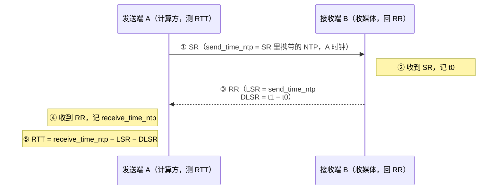
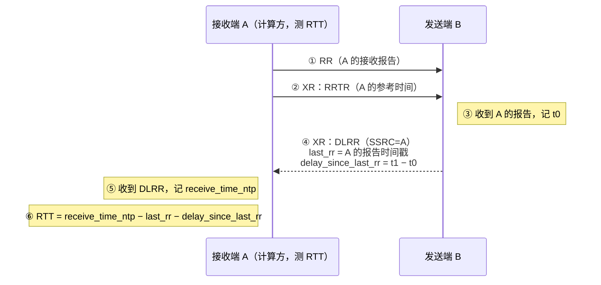
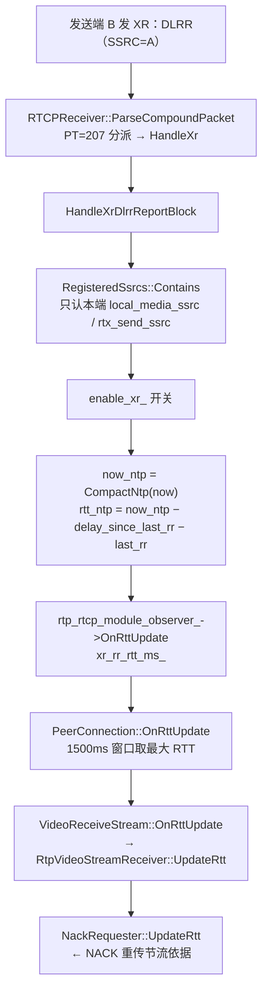

# v2_11.1 RTT 计算原理：发送端 SR/RR（LSR/DLSR）与接收端 XR（RRTR/DLRR）

> 对应课程：`v11.1`（背景知识/理论课，无代码 commit；v11.2 起才是 XR 落地）
> 状态：原理已通（2026-08-24 讨论定调）
> 配套：
> - `v2_4.12-RTT计算原理与压缩NTP.md`（发送端 RTT 深度推导 + 压缩 NTP 单位，**本篇前提**）
> - `v2_4-SR包格式详解.md`（SR 是 LSR/DLSR 的源头）
> - `v2_9.7-音视频同步与SR时间线透传原理.md`（SR 的 NTP 时间戳应用）
> 落地：`v12.1`（`RTCPSender::BuildXR` 发 XR、`RTCPReceiver::HandleXrDlrrReportBlock` 算 RTT）；用途 = 喂给 `NackRequester::UpdateRtt` 做重传退避，**治 v2_10.7 的 RTX 重传风暴**

## 一、为什么接收端也要测 RTT

v2_4.12 讲过的机制（SR/RR + LSR/DLSR）有一个隐含前提：**只有"发 SR 的一方"能算出 RTT**——因为它发出带 NTP 的 SR，对端回 RR 时把时间戳抄回来（LSR），它一减就得往返时延。

但**媒体接收端**（只收 RTP、只发 RR 不发 SR 的一端）拿不到这套原料：它没有 SR 可发，就没有"自己的时间戳被对端抄回"这件事。而接收端恰恰是最需要 RTT 的一方——NACK 重传节流、丢包恢复节奏都依赖 RTT。

出路是 **XR 扩展报告（RFC 3611）**：接收端和发送端**都发 XR**——接收端发 XR 带 **RRTR**（报自己的参考时间），发送端发 XR 带 **DLRR**（把"收到接收端报告的时间"抄回来），这样接收端也能拿到计算原料。**计算思想与发送端完全对称**——本篇就把两个机制并排讲清。

> 一句话：机制 1 是"发送端发 SR，接收端回 RR 把时间抄回来"；机制 2 是"接收端发 XR(RRTR) 报参考时间，发送端发 XR(DLRR) 把时间抄回来"。收到 DLRR 的接收端就能算 RTT。

## 二、机制 1：发送端测 RTT（RFC 3550 SR/RR + LSR/DLSR）——复习

### 2.1 消息流



### 2.2 公式推导

上行单程 `(t0 − send_time_ntp)` + 下行单程 `(receive_time_ntp − t1)` = 一趟完整往返：

```
RTT = (t0 − send_time_ntp) + (receive_time_ntp − t1)
    = (receive_time_ntp − send_time_ntp) − (t1 − t0)
    = receive_time_ntp − LSR − DLSR
```

- **LSR** = send_time_ntp：A 发 SR 时写进 SR 的 NTP，B 收到后**原样抄**进 RR（A 的时钟）
- **DLSR** = t1 − t0：B 自收 SR 到发 RR 的停留（B 端内部差，自产自销）
- **receive_time_ntp**：A 收到 RR 的时刻（A 的时钟）

三个量统一到 **1/2¹⁶ 秒**（压缩 NTP）才能相减——LSR 是 SR 的 NTP 压缩抄回、DLSR 天生 1/2¹⁶、A 也要 `CompactNtp(now)`。**同端相减抵消钟偏、DLSR 自产自销不涉钟差**，这一整套论证见 `v2_4.12` 第六~八节，此处不重复。

## 三、机制 2：接收端测 RTT（RFC 3611 XR：RRTR + DLRR）

### 3.0 角色分工：双方都发 XR，各带一块

| 谁发 XR | 带的块 | 作用 |
|---------|--------|------|
| **接收端 A** | **RRTR** | A 报自己的参考时间（A 上次收到 B 包的时刻），供 B 测单向时延/校准 |
| **发送端 B** | **DLRR** | B 收到 A 的报告后，把"A 的报告时间戳 + B 的停留"抄回来；A 收到后据此算 RTT |

### 3.1 XR 包里的两块：RRTR 和 DLRR

RTCP Extended Reports（XR, PT=207, RFC 3611）包含：

- **XR 头**：`sender_ssrc` 等
- Report Block **RRTR**（Receiver Reference Time Report）—— **接收端 A 发**，参考时间
  - `rrtr` = A 记录"上次收到 B 包"的时刻
- Report Block **DLRR**（Delay since Last RR Report）—— **发送端 B 发**，回带两个时间
  - sub_block `{ SSRC, last_rr, delay_since_last_rr }`（SSRC 指向被报告方 = A）
    - `last_rr` = A 的报告携带的时间戳（被 B 抄回）
    - `delay_since_last_rr` = B 收到 A 的报告 → 发本 XR 的停留

> `v12.1` 落地：A 侧 `rrtr.SetNtp(clock_->ConvertTimestampToNtpTime(ctx.now_))`——A 发 XR 时把参考时刻填进去（收到对端包的时间，本端时钟）。

### 3.2 消息流



关键：**A 不用发 SR**（只发 RR 就够）——B 收到 A 的 RR 后，用 XR(DLRR) 把"A 的报告时间 + B 的停留"抄回来，A 一减就得 RTT。这正是 XR 让"接收端也能测 RTT"的关键。

### 3.3 公式推导（与机制 1 逐项对照）

公式形状一模一样，只是回带载体从 RR 换成 XR：

```
RTT = (t0 − send_time_ntp) + (receive_time_ntp − t1)
    = (receive_time_ntp − send_time_ntp) − (t1 − t0)
    = receive_time_ntp − last_rr − delay_since_last_rr
```

| 概念 | 机制 1（SR/RR） | 机制 2（XR/DLRR） |
|------|----------------|-------------------|
| 回带包 | RR | XR（DLRR 块） |
| "对端回带的本端发送时刻" | **LSR** = SR 的 NTP | **last_rr** = 本端报告的时间戳 |
| "对端停留时间" | **DLSR** = t1 − t0 | **delay_since_last_rr** = t1 − t0 |
| "本端收到回带包的时刻" | **receive_time_ntp** | **receive_time_ntp**（同一概念） |
| 谁在算 | 发 SR 的发送端 | 收 DLRR 的接收端 |

## 四、统一成一个公式

两个机制本质是同一件事：**"我发带时间戳的包 → 你回带 [我的时间戳 + 你的停留] → 我收到后一减得往返"**。

```
                RTT = receive_time_ntp − last_xxx − delay_since_last_xxx
```

| 回带载体 | last_xxx | delay_since_last_xxx |
|----------|----------|---------------------|
| RR       | LSR（SR 的 NTP） | DLSR（t1 − t0） |
| XR/DLRR  | last_rr（本端报告的时间戳） | delay_since_last_rr（t1 − t0） |

**为什么能抵消钟偏**（机制 2 同样成立）：
- `receive_time_ntp` 和 `last_rr` 都是 **A 的时钟**（A 发报告写的时间戳被 B 抄回，A 收 XR 时刻也是 A 的钟）→ 同端相减，钟偏抵消
- `delay_since_last_rr` 是 **B 端内部差**（收包→发 XR），自产自销，与任何一端的绝对时钟无关
- 三量统一到 **1/2¹⁶ 秒**（压缩 NTP）才能减；回绕由无符号模 2³² 减法兜底（详见 v2_4.12 第八节）

## 五、在 xrtcserver 的落地（v12.1）

RTT 从"对端回的 XR 包"一路走到 NackRequester：



**跟 v2_10.7 风暴的关系（别过度声称）**：v12.1 这条 RTT 是**上游**（SFU↔推流端），喂的是**上游 NackRequester**（SFU 收推流端丢包时，找推流端重传）——**不是**下游风暴的直接解药。下游（拉流端 NACK → SFU 重传）风暴的缓解靠 **v12.3/v12.4**：连续性控制（不乱序转发，防拉流端误 NACK）+ 关键帧重发（清旧缓存快速出画）。真要给下游重传加 RTT 退避，需要另接下游 RTT + 重传节流，那是 12.x 之后的活。

### 5.1 这条链路测的是上游：SFU ↔ 推流端（不是 SFU ↔ 拉流端）

v12.1 里 `enable_xr` 只开在 `CreateVideoReceiveStream`（PushStream 收推流端一侧），`CreateVideoSendStream` 没开。所以：

- **上游（v12.1 XR 覆盖）**：客户端推流端 ↔ SFU 收流侧（VideoReceiveStream）。SFU 发 RRTR → 推流端 libwebrtc **自动**回声 DLRR → SFU 算 RTT。推流端**不需要开任何 XR 配置**。
- **下游（v12.1 不覆盖）**：SFU 发流侧（VideoSendStream）↔ 客户端拉流端。没设 `enable_xr`，且 RRTR 发送要求 `!sending_`，发送端发不了。

**下游 RTT 不用 XR**：下游 SFU 是**发送端**，走经典 SR/RR（LSR/DLSR，机制 1）即可测 RTT——SFU 发 SR → 拉流端 libwebrtc 收到后自动回 RR（带 LSR/DLSR）→ SFU 算 `RTT = now − LSR − DLSR`。拉流端也不用开 XR。

**什么时候才需要"拉流客户端开 XR"？** 只有当**拉流端自己**想测 RTT（它是下游的非发送端）时，才需要开 `non_sender_rtt_measurement`。且这是**运行时配置**、不是编译开关：你这版 webrtc 里音频侧公开暴露了 `enable_non_sender_rtt`（`call/audio_receive_stream.h`），但**视频**侧没把该字段透传到公开收流 config（`RtpVideoStreamReceiver2` 有透传参数但没接进生产代码），所以视频侧要么换新版本 libwebrtc、要么 patch 源码把字段透传出来再重编。

**一句话**：SFU 要测 RTT（上游或下游），对端都不用开 XR——上游靠对端自动回 DLRR，下游靠对端自动回 RR(LSR/DLSR)。XR 只服务"**非发送端自己测 RTT**"这一种需求。

## 六、看代码注意点（v12.1 与 RFC/理论的差异）

1. **BuildXR 只填了 RRTR，没填 DLRR**：`v12.1` 的 `RTCPSender::BuildXR` 里 `xr.SetRrtr(...)` 后直接 `AppendPacket`，DLRR 是空的。也就是接收端 A 发的 XR 只有 RRTR——**A 帮对端算 RTT 这条腿没接**。反过来 A 靠 `HandleXrDlrrReportBlock` 解析对端发的 DLRR 算 RTT 这条腿已就位（见第五节流程图），只等对端真的发 DLRR。
2. **RRTR 语义**：RFC 说 RRTR 是"收到对端最近 SR/RR 的时刻"；`v12.1` 直接填 `ctx.now_`（发 XR 的时刻）。语义略有偏差，但不影响本端用 DLRR 算 RTT。
3. **last_rr 要同端才减得对**：`RTT = now − last_rr − delay` 里 `now` 和 `last_rr` 都必须是 A 的时钟才能抵消钟偏。标准里 last_rr 取"被报告方发给对端的报告所携带的时间戳"（SR 的 NTP）。`RegisteredSsrcs` 过滤（`rti.ssrc` 必须等于本端 ssrc/rtx ssrc）保证只处理"关于我们"的 DLRR 子块，不处理别人的。

4. **libwebrtc 里这套 XR 测 RTT 的开关 = `non_sender_rtt_measurement`**（默认 `false`，`modules/rtp_rtcp/source/rtp_rtcp_interface.h:147`）——v12.1 的 `enable_xr` 就是在镜像它：

   | 行为 | 是否被 `non_sender_rtt_measurement` 门控 |
   |------|------------------------------------------|
   | 发 XR:RRTR | ✅ 门控（`rtcp_sender.cc` `if (!sending_ && xr_send_receiver_reference_time_enabled_)`，且要求 `!sending_` 收端） |
   | 收 XR:DLRR 算 RTT | ✅ 门控（`rtcp_receiver.cc` `if (!xr_rrtr_status_) return;`） |
   | 收到 RRTR 自动回 DLRR | ❌ **不门控**（`rtp_rtcp_impl2.cc:286` `ConsumeReceivedXrReferenceTimeInfo()` 无条件） |

   音频侧公开暴露为 `enable_non_sender_rtt`（`call/audio_receive_stream.h:122`，默认 `false`）。

   **实用结论**：
   - **上游**（xrtc-server 的 VideoReceiveStream 收推流端）：xrtc-server 自己发 RRTR（自己的 `enable_xr`），推流端是标准 libwebrtc 就**自动回 DLRR**（不门控）→ xrtc-server 算 RTT，**不需要改客户端配置**。
   - **下游**（VideoSendStream 发拉流端）：要让 libwebrtc 拉流端**自己算 RTT**，才需要在客户端收流配置里开 `non_sender_rtt_measurement`；且 v12.1 发送侧没接 XR（`enable_xr` 只设在接收侧），这条腿目前是空的。

## 七、小结

- 两个机制是**同一套数学**：`RTT = receive_time_ntp − last_xxx − delay_since_last_xxx`
- 机制 1（SR/RR）只让**发送端**测；机制 2（XR/DLRR）让**接收端**也能测——**对称补齐**了 RTT 测量的覆盖
- 关键都在：**同端相减抵消钟偏** + **对端停留自产自销** + **三量统一压缩 NTP 单位**
- v11.2~v11.4 是这套 XR 的第一版落地（后被 v11.5 回滚，v12.1 重做并补全 RegisteredSsrcs 过滤 + OnRttUpdate 上报链），详见课程进度
